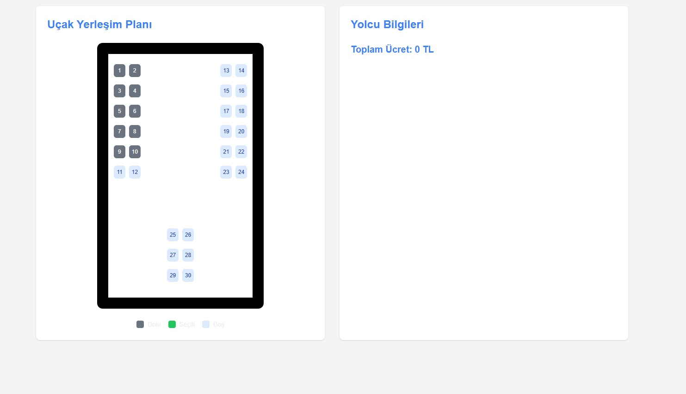

# Uçak Rezervasyon Sistemi

Bu proje, Next.js ve TypeScript kullanılarak geliştirilmiş modern bir uçak rezervasyon sistemidir. Kullanıcılar koltuk seçimi yapabilir, yolcu bilgilerini girebilir ve rezervasyon işlemlerini gerçekleştirebilir.

## 🚀 Özellikler

- İnteraktif koltuk seçim arayüzü
- Gerçek zamanlı koltuk durumu güncellemeleri
- Yolcu bilgileri formu ve veri doğrulama
- LocalStorage ile veri persistance
- Responsive tasarım
- Timeout kontrolü ve oturum yönetimi
- Tooltip ile koltuk bilgisi gösterimi

## 🛠️ Teknolojiler

- Next.js 14
- TypeScript
- Tailwind CSS
- React Toastify
- React Tooltip
- LocalStorage API

## 🎯 Kullanım

1. Ana sayfada uçak yerleşim planından koltuk seçimi yapın
2. Seçilen her koltuk için yolcu bilgilerini girin
3. Tüm bilgiler doldurulduğunda rezervasyon otomatik olarak tamamlanır
4. Seçilen koltuklar sistem tarafından kaydedilir ve sonraki kullanıcılar için dolu olarak görüntülenir

## 📱 Ekran Görüntüleri

